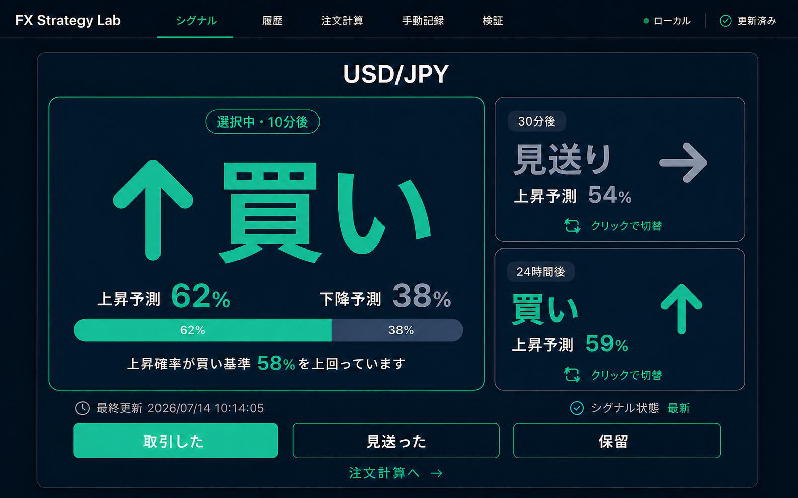

# H-11 Manual Signal UI（local-only / no-POST）

Status: `IMPLEMENTED_LOCAL_ONLY`

## 1. 目的

H-11を自動売買へ接続せず、ユーザーが短期売買の参考にする方向確率を、直感的な
デスクトップ画面で表示する。画面名は **「シグナル」** とし、旧案の「今の判断」は使用しない。

本UIは売買注文を作成・送信しない。手動OPEN/CLOSEの同期に限り、localhost専用経路から
GMO FX Private `GET latestExecutions / openPositions` とKeychainの専用read-only credentialを扱う。
broker write、注文・取消・変更・決済POST、envは扱わない。

## 2. 表示時間軸

- `10分`: 新しいM1低容量logisticモデル。初期選択として大きく表示。
- `30分`: 同じM1特徴量契約を使う別horizonモデル。
- `24時間`: 既存H-11 v2 TREND単独expertを、H1の長期方向コンテキストとして維持。
- `毎秒ローリング`: 10分方向を直近60秒のPublic tickerから毎秒再推定する、非正式・検証前の独立表示。

大きなカードは常に1枚で、残り3シグナルを右側の小カードに表示する。小カードをクリックすると
4つのどれでも大きなカードと入れ替わる。方向の画面表示は `Buy / Sell / Stay / Unknown` の4種類とする。
保存・モデル契約の内部値 `買い / 売り / 見送り / 判定不可` は互換性のため変更しない。
毎秒ローリングはformal forecastではなく、正式な10分シグナルとも別の表示・記録種別である。

各カード内にそのシグナル自身の `p_up` 履歴チャートを表示する。10分・30分・24時間は
`PROSPECTIVE` forecast台帳から最大120点を読む。毎秒ローリングは画面を開いている現在sessionの
最大120点だけを描画し、正式forecast tableへ保存しない。チャートの58%・50%・42%線は表示補助で、
履歴を見た後に閾値を自動変更しない。

```text
買い     p_up >= 0.58
売り     p_up <= 0.42
見送り   0.42 < p_up < 0.58
判定不可 モデル・データ・特徴量のいずれかが不成立
```

## 3. 短期モデル

短期モデルはM1 BID candleだけを使用し、時刻tまでの情報から10本後・30本後の方向確率を別々に
推定する。低容量のL2 logistic regressionであり、初回データ準備時に時系列の先頭70%だけで
学習する。最大horizon分をpurgeし、生成したartifactはlocal-onlyで凍結する。

初回学習後に画面のデータ更新を行っても再学習しない。artifactの削除・置換やmodel version変更は、
別研究versionとして明示的に扱う。

短期モデルの結果はedge証明ではない。未初期化時に仮の確率やモック方向を表示せず、
`判定不可`へfail closedする。

## 4. データと記録

- Market data: GMO外国為替FX Public `GET /v1/klines` のBID candleのみ。
- Live quote: GMO外国為替FX Public WebSocket tickerのBID / ASK。認証・API keyなし。
- 価格・チャート描画: 画面を開いている間、受信済みlatest tickを1秒間隔で描画。
- 正式シグナル更新: 毎分の境界から3秒後にPublic M1確定足を更新し、10分・30分を再計算。
- リアルタイム推定: latest Public tickerをlocalhost内で1秒に1サンプルへ正規化し、直近60秒を
  ローリング足として10分・30分を毎秒再推定する。正式シグナル、正式forecast台帳、24時間モデルは
  変更しない。
- 蓄積初期（約31分未満）は凍結M1履歴と直近60秒を併用する
  `M1_BOOTSTRAP_ROLLING_60S`、31個の十分に密な60秒窓が揃った後は1秒サンプルだけの
  `TICK_NATIVE_ROLLING_60S` と表示する。どちらも非正式・検証前である。
- 24時間シグナル: 新しいcompleted H1を取得したときに再計算（同一H1は重複登録しない）。
- 手動更新: 「データを更新」は初期化・復旧用。通常は毎分schedulerが自動更新する。
- 常駐: browser pageと手動起動local serverの稼働中だけ。launchd / cron / OS常駐なし。
- 保存先: `backend/market_data/h11_manual/`（gitignore済み、commit禁止）。
- 台帳: `signal_ledger.sqlite3`。正式予測、結果、`TRADE_STARTED / NO_ACTION`、1秒Public ticker sampleを
  別tableに分離して記録。`NO_ACTION`は満期まで取引開始記録がなかった客観的事実であり、ユーザーが
  意図的に見送ったとは推定しない。リアルタイム推定は正式forecast tableへ記録しない。
- 出口計画: 10分・30分の正式forecastを根拠に、operatorが入力したentry / stop / take / time exitを
  local tableへ記録する。到達表示と手動終了記録だけで、自動決済・broker建玉確認は行わない。
- raw response、credential、raw broker ID、注文情報は保存しない。execution / position IDはtransport内で
  credential-keyed HMACのopaque refへ変換してからlocal SQLiteへ渡す。

Public GETはread-onlyで認証不要だが、レート制限へ配慮して日付単位の要求間に0.15秒を置く。
エラー時の自動retryは行わない。

Public WebSocketは1接続・1回のsubscribeを使用し、価格変動messageを受信する。切断時の再接続は
5〜30秒のbounded backoffとし、注文POSTのretry/repostとは無関係なPublic read-only再接続である。

## 5. UI面

初期approved mock（実装版はこの構成にリアルタイムチャートを追加）:



主画面に売買判断へ必要な情報を集約し、研究指標は「検証」へ分離する。

- シグナル: 正式3時間軸と毎秒ローリングの4枠。方向・確率・理由・観測時刻・確率履歴を表示。
- 毎秒ローリング: 独立カードとして10分方向の毎秒確率と蓄積modeを明示。
- リアルタイムチャート: 実BID candle、live BID / ASK、spread、1分・10分・30分・1時間切替。
- 履歴: 固定済み予測と結果。
- 注文計算: 独立ページ。選択中の正式10分・30分方向と15秒以内のPublic ASK/BIDを自動反映し、許容損失額
  から1,000通貨単位で数量を切り下げ逆算する。シグナル画面には注文計算ボタンを置かず、注文送信もしない。
- カード内出口: 10分・30分カードごとに固定損切り・利益確定・予測対象時刻と手動終了記録を統合。
  独立した出口管理画面は置かず、自動決済もしない。
- 取引記録: カード内の取引開始で作る`TRADE_STARTED`と、満期後に自動確定する`NO_ACTION`の履歴。
- 検証: Brier / Log loss / 方向精度 / resolved nに加え、確率帯別実現率と閾値別診断。

デスクトップ幅では、左に価格チャート、右に4シグナル（大1＋右側の小3）を同じdashboard rowで配置し、
標準的な画面高ではスクロールせずに同時確認できる。狭い画面では可読性を優先して縦積みに戻す。

## 5.1 保有建玉を前提とした出口シグナル

broker建玉と約定はread-only同期する。10分・30分カードの `取引開始` でoperatorが開始したOPENの手動出口計画だけを
保有状態として扱い、各カード内へ次の優先順位で時間軸別の出口シグナルを独立表示する。

```text
1. 固定損切り価格到達                    -> 損切り
2. 固定利益確定価格到達                  -> 利益確定
3. 事前固定した予測対象時刻到達          -> 時間切れ
4. 15秒以内のPublic価格を確認できない     -> 判定不可
5. 反対方向の正式基準を2回連続で満たす    -> 損切り候補
6. 正式確率が50%中立線を不利側へ越える    -> 警戒
7. 上記以外                              -> 継続
```

買い建玉の反対方向正式基準は `p_up <= 0.42`、売り建玉は `p_up >= 0.58`。10分建玉は10分正式予測、
30分建玉は30分正式予測だけを使用し、毎秒ローリングは出口モデル判定へ使用しない。
`損切り候補`を含むすべての表示はoperator向け情報であり、自動決済、注文命令ではない。
固定SL / TP / time exitをモデルより優先し、反対シグナル1回だけで損切り候補へ切り替えない。

各時間軸カードの出口シグナルには、そのカードのOPEN手動出口計画がある間だけワンクリック決済記録を表示する。
`損切り / 利益確定 / 時間切れ`到達時は対応する終了理由、`損切り候補`は損切り、`警戒 / 継続`は
手動終了として、買いは15秒以内のPublic BID、売りは15秒以内のPublic ASKを終了価格へ記録する。
Public価格が判定不可、価格stale、二重クリック中は記録しない。正式signalだけが不明な場合は、
operatorによる手動終了として記録できる。これはlocal ledger上の手動決済記録であり、
broker建玉の決済、Private API、注文POSTではない。

## 5.2 正式な毎秒シグナルへの昇格条件

現在のリアルタイム推定は自動昇格しない。少なくとも次を別Stepで満たし、operatorが明示承認した後に
新versionとして扱う。

- 十分な期間の1秒sampleが保存され、欠損・停止・再接続区間を識別できる。
- 10分・30分の将来labelを1秒時点ごとに作り、強いoverlapを考慮したpurge / embargoで評価する。
- 現行の毎分正式シグナル、単純baselineとの比較、Brier / Log loss / calibrationを凍結条件で行う。
- 1秒ごとのsignal flicker、coverage、データ遅延時のfail-closed条件を事前固定する。
- 正式forecast ledger、UI名称、validation contractを別versionとしてレビューする。

## 6. 安全境界

専用entrypoint `app.main_h11_manual:app` を使い、`app.main`、`app.main_readonly`、broker、
`app.live_verification`、H-11 v3 transportをimportしない。hostはlocalhostだけを許可し、
launcherも `127.0.0.1` に固定する。

```text
actual_post=false
broker_read=GET_ONLY_WHEN_DEDICATED_KEYCHAIN_PAIR_IS_CONFIGURED
broker_write=false
private_api=LATEST_EXECUTIONS_AND_OPEN_POSITIONS_GET_ONLY
credential_read=SEALED_KEYCHAIN_ONLY_WHEN_CONFIGURED
env_read=false
automatic_trade_authority=false
```

このUIをpublic deploymentへ追加してはならない。`backend/app/main_readonly.py`は変更しない。

## 7. 毎秒ローリング検証UI（2026-07-15追加）

検証画面に「毎秒ローリング検証」を正式検証と分けて表示する。10分・30分を切り替え、raw件数、
horizon間隔の非重複N、対象価格欠測、解決coverage、Brier / Log loss / calibration / 閾値診断、
推定mode内訳を確認できる。

毎秒推定は別tableへ保存し、10分・30分後の対象BIDを15秒以内に観測できた場合だけ解決する。
超過時は `TARGET_PRICE_MISSING` に固定する。この表示は正式化条件の材料を集めるだけで、正式シグナル、
出口シグナル、売買権限、閾値を変更しない。

## 8. ワンクリック出口開始（2026-07-15追加）

正式10分・30分の各シグナルカードは、方向にかかわらず取引開始ボタンを常時表示する。`Stay`は
`取引開始（Stay）`、Unknownは`取引開始（判定待ち）`、価格条件不足は`取引開始（価格待ち）`として
disabledにし、ボタンが消えたように見せない。正式方向が `Buy` または `Sell` で、15秒以内のPublic
tickerを確認できる場合だけ、カード内の `Buyで取引開始` / `Sellで取引開始` 1回で取引記録とローカル
出口計画を開始する。買いは最新ASK、売りは
最新BIDを参考entryとして使用し、既存presetの固定SL 15pips、固定TP 22.5pips、予測対象時刻の
time exitを設定する。二重クリック中はボタンを無効化する。OPEN計画は10分・30分で各1件までとし、
同一時間軸の二重開始はDB unique constraintで拒否する。画面の手動登録建玉数は0〜2件で、broker建玉数ではない。

成功後もシグナル画面に留まり、開始した時間軸カードへ出口状態・約定補正・決済記録を即時表示する。
10分と30分はそれぞれ独立した出口シグナルを持てる。24時間は `参考表示・取引対象外`、毎秒ローリングは
`検証前・取引対象外` とする。独立した出口管理画面は設けない。
開始条件が揃わない場合はボタンをdisabledにし、出口計画を伴わない `TRADE_STARTED` 記録だけを作らない。

これはbroker約定確認ではなく、Public価格を使った迅速な参考設定である。実約定価格が異なる場合は、
開始後に同じシグナル画面から補正する。価格が15秒超、見送り・判定不可、24時間、毎秒ローリングの場合は
ワンクリック開始しない。broker read/write、自動決済、注文送信は行わない。

## 9. ワンクリック決済記録（2026-07-15追加・read-only同期によりUI廃止）

この手動入力UIは§13のread-only同期により廃止した。過去契約の記録として以下を残す。

```text
損切り価格到達 / 損切り候補 -> 損切りで決済記録
利益確定価格到達             -> 利益確定で決済記録
予測対象時刻到達             -> 時間切れで決済記録
警戒 / 継続 / 正式signal不明  -> 現在価格で決済記録（理由=手動終了）
価格不明                     -> 価格確認待ち（disabled）
```

ボタンは1クリックでlocal ledgerをCLOSEDにする。買いの終了価格はPublic BID、売りはPublic ASKとし、
受信から15秒を超えた価格は使用しない。保存中は同じ操作を再実行できない。実際のbroker決済はユーザーが
別途行う必要があり、本UIはbroker側の決済完了を確認しない。

## 10. シグナル画面内の実約定価格補正（2026-07-15追加・read-only同期によりUI廃止）

この手動入力UIは§13のread-only同期により廃止した。過去契約では、対応する時間軸カード内に `約定` 入力と
`反映` ボタンを表示した。ユーザーがbroker
画面で確認した実約定価格を入力すると、画面遷移せずlocal出口計画のentry価格を補正する。同時に買い・
売り方向を維持して固定SL 15pips / TP 22.5pipsを同じ距離で再計算する。

補正対象はOPENかつ固定quick-start presetの計画だけとする。保存中の二重操作、非有限値、0以下、
すでにCLOSEDの計画、独自SL/TPを持つ手入力計画は拒否する。変更前後のentry / SL / TPは
`manual_trade_plan_fill_corrections`へappendし、主表示へ `約定補正済み`を表示する。

価格はoperatorの手入力であり、broker APIによる約定確認ではない。Private API、credential、broker read、
注文・決済POSTは行わない。

## 11. 手動決済のPrivate API同期（承認・実装済み）

GMO FX Private `GET /private/v1/latestExecutions` と `GET /private/v1/openPositions` だけを5秒間隔で
pollし、手動OPEN/CLOSEをlocal出口計画へ反映する。Private WebSocketはtoken取得にPOST/PUTが必要なため
使用しない。actual transportは専用Keychain pairが存在するときだけ構築し、未設定時は通信不能である。

OPENは方向・時刻窓・未使用executionの一意性が揃う場合だけ紐付け、実約定価格・数量を自動反映する。
候補が複数、または複数local planが同じexecution候補を共有する場合は `AMBIGUOUS_OPEN` で停止する。
CLOSEはopaque position lineageで一致したexecutionだけを累積し、部分決済は残数量を表示、全数量到達時だけ
local計画を `API同期決済` でCLOSEDにする。execution refの一意制約で重複pollを冪等化する。
openPositionsからlinked positionが消えたのにCLOSE約定が揃わない場合は、推測でcloseせず
`RECHECK_REQUIRED` とする。

SQLiteへ保存するのはopaque ref、symbol、side、OPEN/CLOSE、数量、価格、時刻、safe stateだけである。
raw response、raw execution/order/position ID、credential、header、signatureはUI・ログ・SQLiteへ出さない。
`main_readonly.py`は変更せず、public deploymentへrouteを追加しない。

## 12. 取引操作記録の簡略化とリスク数量計算（2026-07-15追加）

シグナル画面から `見送った / 保留 / 注文計算へ` を削除し、ユーザー操作は正式10分・30分カード内の
`取引開始`だけとする。quick-startと同時に`signal_actions`へ`TRADE_STARTED`を一意記録する。同じ
PROSPECTIVE forecastが満期を迎えた時点で同actionがなければ、次のlocal current/refresh時に`NO_ACTION`
を一意にbackfillする。対象は10分・30分だけで、24時間と毎秒ローリングは含めない。

`NO_ACTION`の表示文は `取引開始記録なし` とし、未閲覧、判断中、意図的見送りを区別・推測しない。
forecast/resolutionとsignal actionは別tableであり、Brier / Log loss / 方向精度は従来どおり全ての
PROSPECTIVE予測を同じ分母で採点する。
旧版の`manual_trade_plan_quick_starts`が存在するforecastは、起動時migrationで`TRADE_STARTED`へ移行する。
同じforecastへ`NO_ACTION`が先に作られていても、既存quick-startという客観的証拠がある場合だけ訂正する。

独立した注文計算ページは、選択中の正式10分・30分方向を初期値にし、買いは15秒以内のPublic ASK、売りは
Public BIDを想定約定価格へ自動反映する。許容損失額を`(損切りpips + 追加片道コスト×2) × 0.01円 × 数量`
で除し、1,000通貨単位で切り下げる。Public価格がない場合は手入力できる。追加コストはspreadを含む
ASK/BIDとは別に見込むslippage・手数料用であり、計算結果から注文や出口計画を開始しない。

## 13. read-only同期後のカードUI（2026-07-15追加）

各10分・30分カードは、出口シグナルに加えて次のbroker同期状態を表示する。

```text
WAITING_FOR_OPEN   -> OPEN約定待ち
AMBIGUOUS_OPEN     -> OPEN照合不明
LINKED             -> OPEN照合済み（実約定価格・数量を反映）
PARTIALLY_CLOSED   -> 部分決済（残数量を表示）
RECHECK_REQUIRED   -> 同期要確認（自動closeしない）
CLOSED             -> CLOSE反映済み
```

自動把握できるため、カード内の実約定価格入力・反映ボタンと、Public価格でのローカル決済記録ボタンは削除した。
上部には `管理中`（local plan件数）、`Broker`（openPositions件数）、最終同期状態を表示する。追加UIは
safe aggregateだけで、raw IDやbroker responseは表示しない。同期が未設定または正常同期できていない間は
新しい `取引開始` をdisabledにする。

色契約は `Stay=青`、`Buy/Sell=黄`、`Unknown=灰` とする。色だけに依存せず文字ラベルも維持する。
